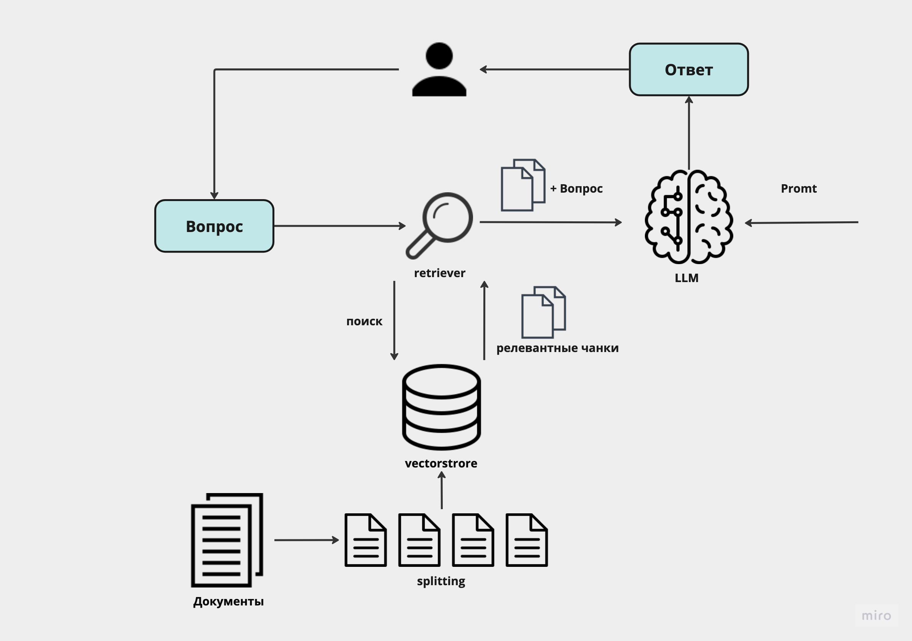
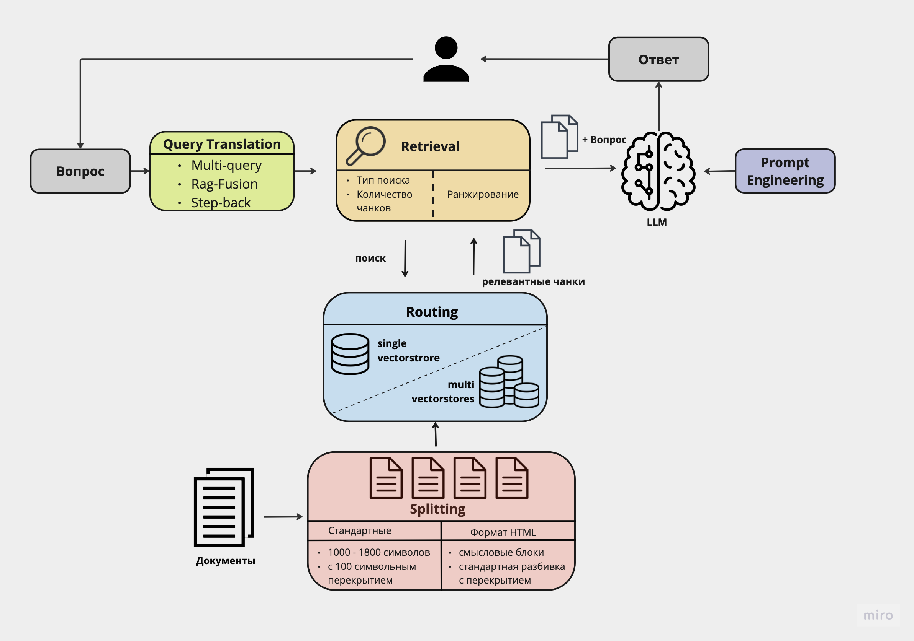
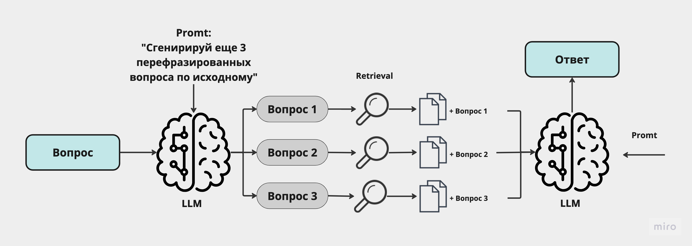
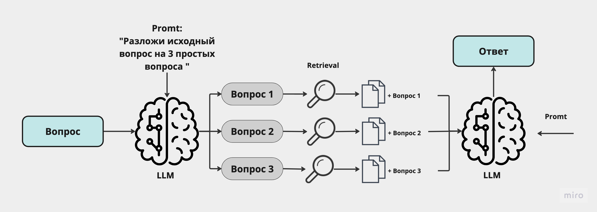
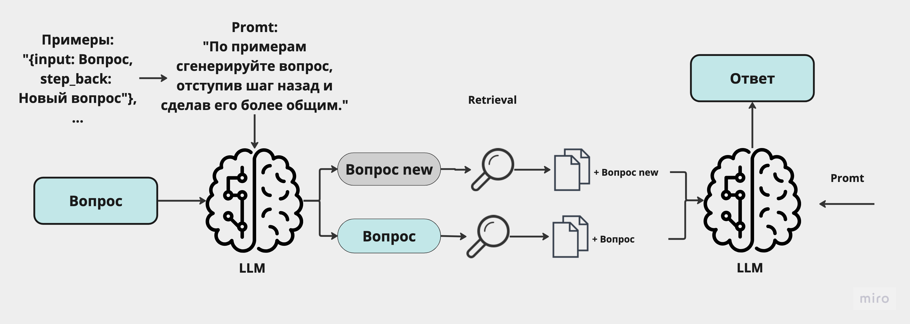
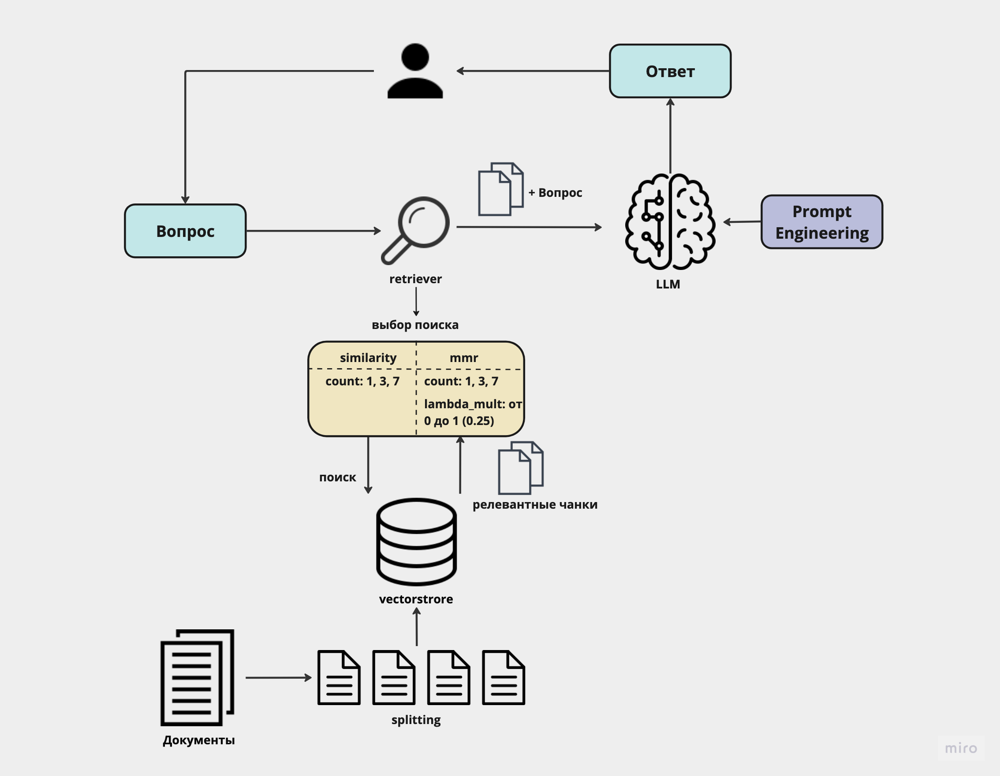
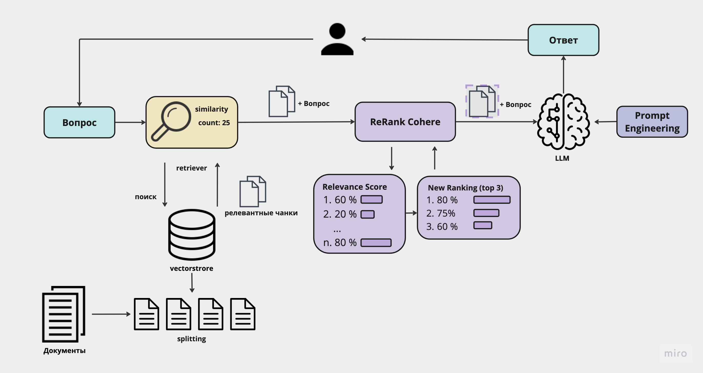
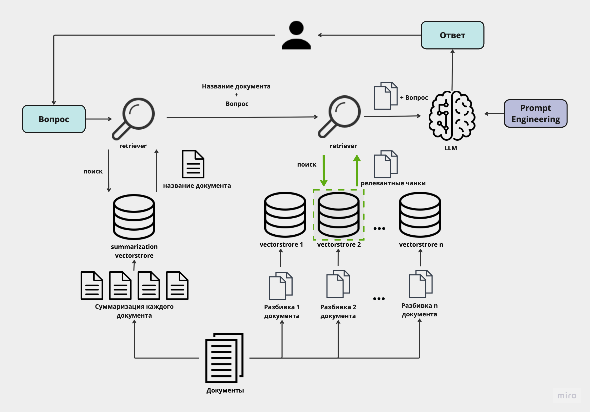
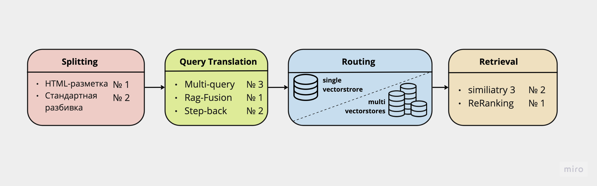

# Advanced RAG. Программные методы повышения качества работы LLM в вопросно-ответных системах

### Немного о чем работа
Вместо обучения языковых моделей для нужной предметной области можно использовать алгоритм RAG, который подключает к исходной модели базу данных с необходимой информацией (в данном случае пользовательские соглашения Tinkoff) и помогает производить по ней поиск. Базовые алгоритмы RAG уже обладают хорошей точностью порядка 70-80%. Для повышения качества ответа используется Advanced RAG, который включает тонкую настройку модулей алгоритма RAG. В этом репозитории будут представлены методы, способные повысить точность ответа до 94%.

## Базовый RAG

Реализация - STEPPING/Base_RAG.ipynb

| **Metric**            | **Base rag** |
|-----------------------|--------------|
| **Faithfulness**      | 0.839286     |
| **Answer relevancy**  | 0.711729     |
| **Context relevancy** | 0.754918     |
| **Answer similarity** | 0.923925     |
| **Sim-spacy**         | 0.857789     |
| **Human score**       | 0.689655     |

# Advanced RAG
Следующая схема показывает какие модули будут улучшаться

# Модули Advanced RAG:

## Splitting

- Реализация - STEPPING/RAG_Splitting.ipynb
- Результат  - all_ratings/final_result/final_step_splitting.ipynb

| Метрика            | Base rag | RAG standart_split 1800 | RAG standart_split 1200/100 | My html_split | html_split 1800 / 100 | html_split 1000 / 100 |
|---------------------|----------|-------------------------|-------------------------------|-----------------------------|------------------------|-----------------------|
| Faithfulness        | 0.839286 | 0.779718                | 0.850758                      | 0.931481                    | 0.869792               | 0.923077              |
| Answer relevancy    | 0.711729 | 0.675531                | 0.633100                      | 0.579447                    | 0.500734               | 0.605244              |
| Context relevancy   | 0.754918 | 0.793711                | 0.801757                      | 0.774458                    | 0.811815               | 0.792418              |
| Answer similarity   | 0.923925 | 0.912350                | 0.914586                      | 0.909015                    | 0.908620               | 0.922121              |
| Sim-spacy           | 0.857789 | 0.817984                | 0.807411                      | 0.829006                    | 0.837442               | 0.844741              |

## Query Translation

Схемы 3 методов:

  
  
  

- Реализация - STEPPING/RAG_Query_Translation.ipynb
- Результат  - all_ratings/final_result/final_step_query_translation.ipynb

| Метрика            | Base rag | standart_split - rag_step_back | html_split - rag_fusion | html_split - rag_multi_query | html_split - rag_step_back |
|---------------------|----------|--------------------------------|-------------------------|------------------------------|-----------------------------|
| Faithfulness        | 0.839286 | 0.882857                       | 0.934524                | 0.802299                     | 0.894144                    |
| Answer relevancy    | 0.711729 | 0.775836                       | 0.781693                | 0.671017                     | 0.833722                    |
| Context relevancy   | 0.754918 | 0.798022                       | 0.803194                | 0.787677                     | 0.793711                    |
| Answer similarity   | 0.923925 | 0.932193                       | 0.925964                | 0.916761                     | 0.929158                    |
| Sim-spacy           | 0.857789 | 0.882171                       | 0.854943                | 0.834115                     | 0.862769                    |

## Retrieval

Схемы 2 подходов:

  
  

- Реализация - STEPPING/RAG_Retrieval.ipynb   |    STEPPING/RAG_Retrieval_Rerank.ipynb
- Результат  - all_ratings/final_result/final_step_retrieval.ipynb

| Метрика            | Base rag | html_split - 3_similiatry | html_split - compressor_rerank | html_split - rerank_gigachat | html_split - rerank_gpt_3.5 |
|---------------------|----------|---------------------------|---------------------------------|-------------------------------|-----------------------------|
| Faithfulness        | 0.839286 | 0.903659                  | 0.934314                        | 0.842449                      | 0.916155                    |
| Answer relevancy    | 0.711729 | 0.706977                  | 0.721179                        | 0.763434                      | 0.853961                    |
| Context relevancy   | 0.754918 | 0.785522                  | 0.818568                        | 0.782361                      | 0.803194                    |
| Answer similarity  | 0.923925 | 0.928373                  | 0.924924                        | 0.921375                      | 0.922967                    |
| Sim-spacy           | 0.857789 | 0.841781                  | 0.863760                        | 0.866616                      | 0.893530                    |

## Routing

- Реализация - STEPPING/RAG_Routing.ipynb
- Результат  - all_ratings/final_result/final_step_routing.ipynb

| Метрика            | Base rag | standart_split - routing | standart_split - routing_1900 | html_split - routing | html_split - routing_1900_promt |
|---------------------|----------|--------------------------|--------------------------------|----------------------|---------------------------------|
| Faithfulness        | 0.839286 | 0.824797                 | 0.878231                       | 0.805952             | 0.924962                        |
| Answer relevancy    | 0.711729 | 0.656595                 | 0.610366                       | 0.602522             | 0.704511                        |
| Context relevancy   | 0.754918 | 0.773022                 | 0.807504                       | 0.773022             | 0.769430                        |
| Answer similarity  | 0.923925 | 0.917842                 | 0.913813                       | 0.910303             | 0.922524                        |
| Sim-spacy           | 0.857789 | 0.844044                 | 0.833408                       | 0.815391             | 0.858856                        |

## Комбинации Advanced RAG из всех модулей

- Реализация - STEPPING/Advanced_RAG.ipynb
- Результат  - all_ratings/final_result/final_step_advanced_rag_mini.ipynb

| Метрика            | Base rag | Base rag gpt | RAG+_1_gpt_3.5 | RAG+_3_gpt_3.5 | RAG+_4_gpt_3.5 | RAG+_5_gpt_3.5 |
|---------------------|----------|--------------|----------------|----------------|----------------|----------------|
| Faithfulness        | 0.839286 | 0.854735     | 0.934930       | 0.716726       | 0.716726       | 0.877778       |
| Answer relevancy    | 0.711729 | 0.839272     | 0.832147       | 0.751150       | 0.751150       | 0.842827       |
| Context relevancy   | 0.754918 | 0.798884     | 0.767275       | 0.783798       | 0.783798       | 0.792418       |
| Answer similarity  | 0.923925 | 0.926247     | 0.927357       | 0.920985       | 0.920985       | 0.929259       |
| Sim-spacy           | 0.857789 | 0.886603     | 0.874437       | 0.868104       | 0.868104       | 0.898265       |
| Human score         | 0.689655 | 0.724138     | 0.827586       | 0.939655       | 0.758621       | 0.870690       |

